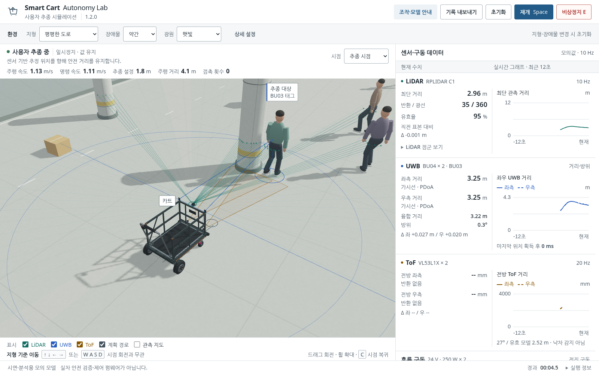

# Smart Cart Autonomy Lab

**Version 1.2.0** · An interactive, sensor-driven smart-cart simulation. Static HTML, CSS, classic JavaScript and WebGL 2. No backend, build step, account or CDN.

[한국어](README-KR.md) · [Open the simulator](simulator/index.html) · [Changelog](simulator/docs/CHANGELOG.md) · [Verification](simulator/docs/QA.md)



## Changes in 1.2.0

The driving summary now sits in a compact upper band. Speed, commanded speed, follow distance, odometer and contacts no longer consume a separate panel below the scene. The main working surface gains vertical space without shrinking essential text.

Movement is **fixed to terrain coordinates, not the camera**. Holding W or an arrow while orbiting keeps the same world direction; orbiting, zooming and restoring the camera do not steer the person. Swinging feet now advance, stance feet recede relative to the body, and gait phase follows actual travelled distance. Both the tagged user and autonomous pedestrians use the same corrected articulation.

The right-hand instruments have **current values on the left and live graphs on the right**. LiDAR, UWB, ToF, rear-motor current and front-steering plots are always displayed, with units, a 12-second window and distinguishable line styles. Scroll the shared rail for lower instruments. Only the supplementary LiDAR point cloud and event log remain expandable. At 520 CSS px and below, graphs reflow below values rather than becoming tiny or hidden.

The outermost documents are now **README.md** and **README-KR.md**, with reciprocal language links. There are no alternative README-SIMULATION filenames in this release.

## Run and deploy

Extract the ZIP and open `simulator/index.html` in a WebGL 2-capable browser. A root `index.html` also redirects there. All runtime assets are local. Browser policies may restrict local HTML; see the [integration guide](simulator/docs/INTEGRATION-KR.md).

For the existing `smart_cart_app` repository, copy the **contents** of this package into the repository root and replace `simulator/` completely. The package does not replace Flutter `lib/`, `web/`, Android, Windows or the upstream license. **The root README files are intentionally replaced**; merge or back up any Flutter-specific introduction before copying. Remove the old `README-SIMULATION.md` and `README-SIMULATION-KR.md` files left by earlier versions.

Use **Settings → Pages → GitHub Actions** with the included workflow to publish `simulator/` as the site root. Alternatively publish the repository root from a branch; its entry redirects into `simulator/`. Review any existing Pages workflow to avoid two competing deployments. This package was prepared locally; no remote commit, push, Actions run or deployment was performed.

## Controls

| Input | Action |
|---|---|
| W / ↑ | Fixed forward, world +Z |
| S / ↓ | Fixed backward, world -Z |
| A / ← | Fixed left, world +X |
| D / → | Fixed right, world -X |
| Drag / wheel / C | Orbit / zoom / restore the follow camera, without changing movement axes |
| Space / E | Pause or resume / latch or release the simulated emergency stop |

Left/right are defined looking forward from the initial rear observer. Diagonals are normalized. The person faces actual travel. Touch buttons use the same fixed axes. A camera facing the opposite way will naturally show world-forward movement in the opposite screen direction; it does not change the input mapping.

Settings and help pause the session; dismissing them does not resume automatically. Applying settings deliberately resets and starts a new session. Losing focus clears held input and pauses. Form controls retain native keyboard behavior.

## Retained simulation

Flat roads, up/down/combined slopes and ascending stairs share one controllable world. Columns are fixed, pedestrians have individual goals, and boxes can move under an impulse. Artificial light, sunlight angles and low light change the scene, not the light-only SANE interface. The cart follows estimated UWB position using LiDAR/forward-ToF observations, an occupancy map and constrained motion candidates. Reverse and near-side repositioning remain available when modeled clearance permits.

Rear-wheel animation, RPM, current estimates, PWM, acceleration, grade force, finite braking and front Ackermann steering are computed from the simulation. Exports include CSV, session JSON, Flutter-shaped telemetry JSON, settings JSON and PNG. No transport connection to Flutter or a real cart is opened.

## Scope and limitations

This is a demonstration model, not validated firmware or a calibrated digital twin. Stairs and excessive grades use an explicit known-terrain guard; the two forward-facing ToF sensors are **not cliff sensors**. Initial rear-only UWB ranges do not invent an unambiguous tag bearing. Low rear obstacles can remain unobserved. Sensor errors, motors, braking, friction and masses are uncalibrated assumptions. Normal commanded stops request a modeled parking brake, unlike unbraked coasting.

Gait is two-bone visual articulation, not whole-body biomechanics or a contact solver for arbitrary turns and terrain. See [model and limits](simulator/docs/MODEL.md), [sources](simulator/docs/SOURCES.md) and [rights](simulator/SOURCE-NOTICE.md).

## Tests and documentation

```sh
node tests/core.test.cjs
node tests/bugfix.test.cjs
node tests/release120.test.cjs
python tests/static.test.py
```

Browser test tools require Python Playwright and Chromium only for QA, not for using the app. The [QA report](simulator/docs/QA.md) distinguishes real DOM/WebGL tests and completed downloads from environment-blocked browser URL entry and untested remote deployment. [Manual checks](simulator/docs/TEST-CASES.md) cover the release changes.

[Live drive instruments](simulator/assets/preview-drive.png) · [Mobile layout](simulator/assets/preview-mobile.png) · [Slope articulation](simulator/assets/preview-slope.png)
